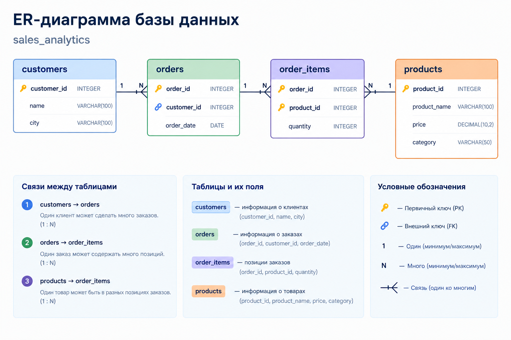

# Sales Analytics — SQL-проект

## О проекте

Portfolio-проект по анализу продаж с использованием **PostgreSQL**.

В рамках проекта создана реляционная база данных с информацией о клиентах, заказах, товарах и позициях заказов. На основе этих данных проведён анализ продаж, клиентов, товаров и заказов с использованием SQL.

Проект ориентирован на типовые задачи, которые могут встречаться в работе **Junior Data Analyst**.

## Бизнес-задачи

### Продажи

* расчёт общей выручки;
* количество заказов;
* средний чек;
* динамика выручки по месяцам;
* сравнение выручки текущего и предыдущего месяца.

### Клиенты

* определение клиентов с наибольшей выручкой;
* поиск клиентов с выручкой выше заданного значения;
* поиск клиентов без заказов;
* расчёт среднего чека по каждому клиенту;
* ранжирование клиентов по выручке.

### Товары

* определение топ-5 товаров по выручке;
* анализ выручки по категориям;
* анализ количества проданных единиц по категориям.

### Заказы

* определение топ-3 заказов по стоимости;
* анализ стоимости заказов вместе с информацией о клиентах.

## Структура базы данных

```text
customers
    │
    │ 1 : N
    ▼
orders
    │
    │ 1 : N
    ▼
order_items
    │
    │ N : 1
    ▼
products
```

### ER-диаграмма



### Таблицы

**customers** — информация о клиентах

| Поле        | Описание    |
| ----------- | ----------- |
| customer_id | ID клиента  |
| name        | Имя клиента |
| city        | Город       |

**products** — информация о товарах

| Поле         | Описание        |
| ------------ | --------------- |
| product_id   | ID товара       |
| product_name | Название товара |
| price        | Цена            |
| category     | Категория       |

**orders** — информация о заказах

| Поле        | Описание    |
| ----------- | ----------- |
| order_id    | ID заказа   |
| customer_id | ID клиента  |
| order_date  | Дата заказа |

**order_items** — состав заказов

| Поле       | Описание   |
| ---------- | ---------- |
| order_id   | ID заказа  |
| product_id | ID товара  |
| quantity   | Количество |

## Данные

В базе данных:

* **20 клиентов**
* **15 товаров**
* **40 заказов**
* **100 позиций заказов**

Для расчёта выручки используется формула:

```text
Revenue = Product Price × Quantity
```

## Основные показатели

| KPI                 | Значение |
| ------------------- | -------: |
| Общая выручка       |  $31,950 |
| Количество заказов  |       40 |
| Средний чек         |  $798.75 |
| Количество клиентов |       20 |
| Количество товаров  |       15 |

## Результаты анализа

### Топ-5 клиентов по выручке

| Клиент         | Выручка |
| -------------- | ------: |
| Алексей Иванов |  $7,290 |
| Алина Соколова |  $4,320 |
| Арман Нурланов |  $2,950 |
| Диана Ахметова |  $2,430 |
| Максим Волков  |  $2,175 |

### Топ-5 товаров по выручке

| Товар         | Выручка |
| ------------- | ------: |
| Laptop Pro 15 |  $9,600 |
| Laptop Air 13 |  $5,400 |
| 4K Monitor    |  $3,600 |
| Standing Desk |  $3,300 |
| Office Chair  |  $2,100 |

### Выручка по категориям

| Категория   | Выручка |
| ----------- | ------: |
| Electronics | $23,770 |
| Furniture   |  $5,890 |
| Accessories |  $1,210 |
| Stationery  |  $1,080 |

### Динамика выручки по месяцам

| Месяц        | Выручка |
| ------------ | ------: |
| Январь 2026  |  $3,710 |
| Февраль 2026 |  $3,285 |
| Март 2026    |  $4,815 |
| Апрель 2026  |  $2,740 |
| Май 2026     |  $4,210 |
| Июнь 2026    |  $3,750 |
| Июль 2026    |  $3,835 |
| Август 2026  |  $5,605 |

### Ключевые наблюдения

* Наибольшую выручку среди категорий принесла **Electronics — $23,770**.
* Самым доходным товаром стал **Laptop Pro 15 — $9,600**.
* Максимальная месячная выручка была в **августе 2026 года — $5,605**.
* Минимальная месячная выручка была в **апреле 2026 года — $2,740**.
* Топ-5 клиентов обеспечили значительную долю общей выручки проекта.

## SQL-навыки

В проекте использовались:

* `SELECT`
* `WHERE`
* `JOIN`
* `LEFT JOIN`
* `GROUP BY`
* `HAVING`
* `ORDER BY`
* `LIMIT`
* `SUM`
* `COUNT`
* `AVG`
* `CTE`
* оконные функции
* `RANK`
* `LAG`
* `DATE_TRUNC`
* многоуровневая агрегация
* расчёт бизнес-метрик
* анализ продаж, клиентов и товаров

## Примеры SQL-запросов

### Топ-5 клиентов по выручке

```sql
SELECT
    c.customer_id,
    c.name,
    SUM(p.price * oi.quantity) AS total_revenue
FROM customers c
JOIN orders o
    ON c.customer_id = o.customer_id
JOIN order_items oi
    ON o.order_id = oi.order_id
JOIN products p
    ON oi.product_id = p.product_id
GROUP BY
    c.customer_id,
    c.name
ORDER BY total_revenue DESC
LIMIT 5;
```

### Динамика месячной выручки

```sql
SELECT
    DATE_TRUNC('month', o.order_date) AS month,
    SUM(p.price * oi.quantity) AS total_revenue
FROM orders o
JOIN order_items oi
    ON o.order_id = oi.order_id
JOIN products p
    ON oi.product_id = p.product_id
GROUP BY DATE_TRUNC('month', o.order_date)
ORDER BY month;
```

## Структура проекта

```text
sales-analytics/
│
├── README.md
│
├── images/
│   └── er_diagram.png
│
└── sql/
    ├── 01_create_tables.sql
    ├── 02_insert_data.sql
    └── analysis_queries.sql
```

### SQL-файлы

* [`01_create_tables.sql`](sql/01_create_tables.sql) — создание таблиц и ограничений.
* [`02_insert_data.sql`](sql/02_insert_data.sql) — заполнение базы тестовыми данными.
* [`analysis_queries.sql`](sql/analysis_queries.sql) — аналитические SQL-запросы.

## Инструменты

* **PostgreSQL**
* **SQL**
* **DBeaver**
* **GitHub**

## Цель проекта

Цель проекта — продемонстрировать практические навыки работы с SQL и реляционными данными:

* объединение нескольких таблиц;
* агрегация и группировка данных;
* расчёт бизнес-метрик;
* работа с `CTE`;
* использование оконных функций;
* анализ динамики показателей;
* подготовка данных для дальнейшей визуализации.

Проект создан как часть портфолио для позиции **Junior Data Analyst**.
