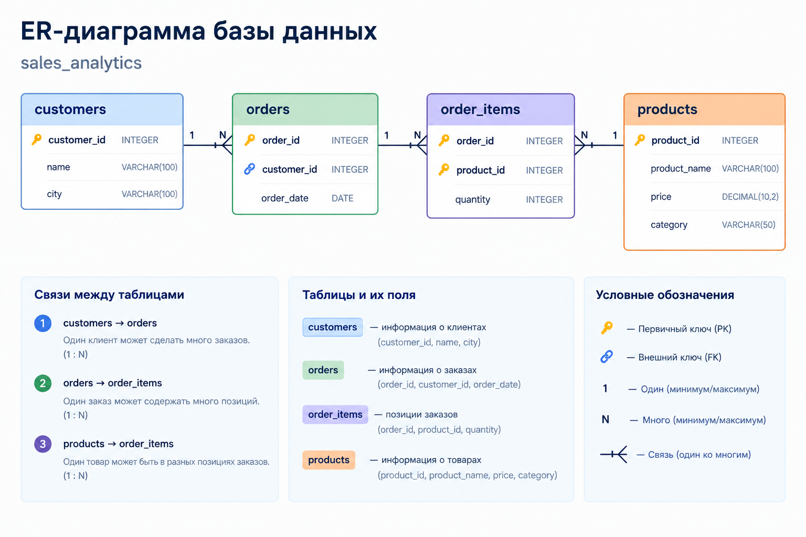
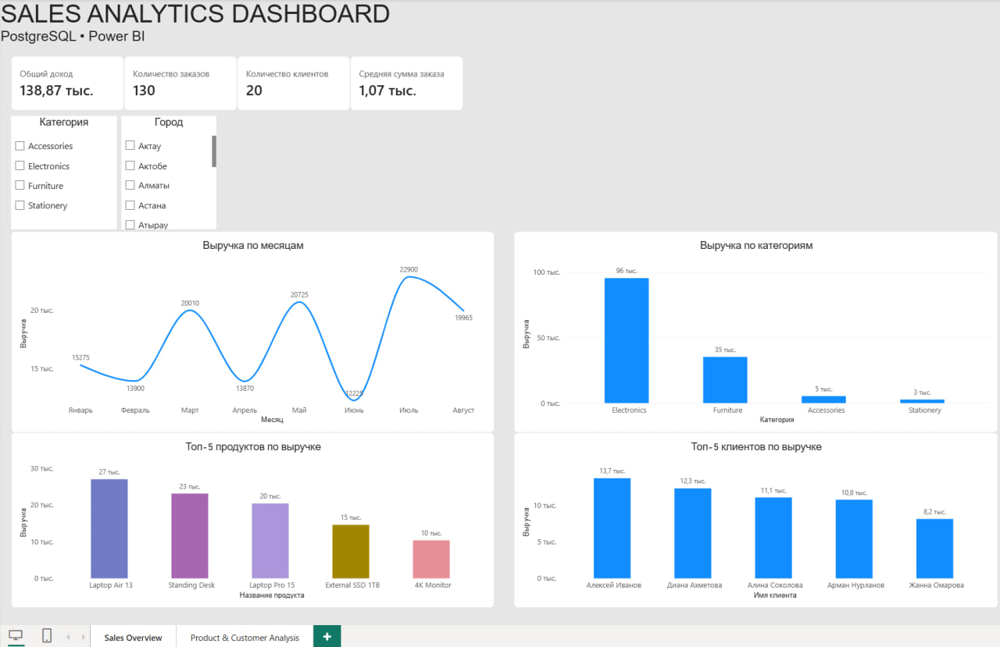
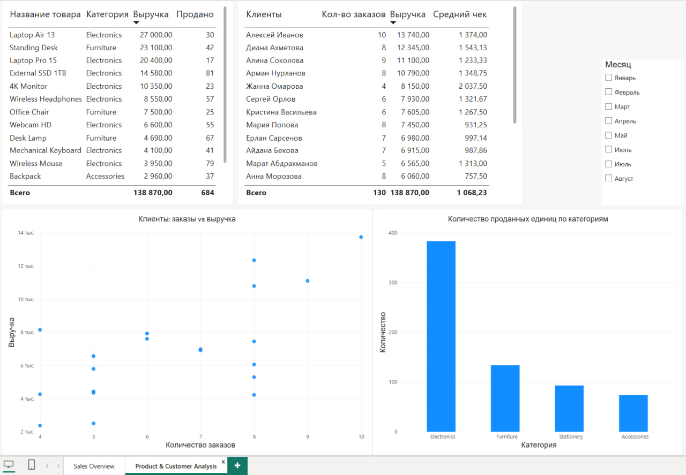

# Sales Analytics — SQL + Power BI

## О проекте

Портфолио-проект по анализу продаж с использованием **PostgreSQL** и **Power BI**.

В рамках проекта создана реляционная база данных с информацией о клиентах, заказах, товарах и позициях заказов. С помощью SQL проведён анализ продаж, клиентов, товаров и заказов. На основе полученных данных создан интерактивный аналитический дашборд в Power BI.

Проект ориентирован на типовые задачи, которые могут встречаться в работе **Junior Data Analyst**.

---

## Бизнес-задачи

### Продажи

- расчёт общей выручки;
- количество заказов;
- средний чек;
- динамика выручки по месяцам;
- сравнение показателей между периодами.

### Клиенты

- определение клиентов с наибольшей выручкой;
- поиск клиентов с выручкой выше заданного значения;
- поиск клиентов без заказов;
- расчёт среднего чека по клиентам;
- ранжирование клиентов по выручке;
- анализ количества заказов и выручки клиентов.

### Товары

- определение топ-5 товаров по выручке;
- анализ выручки по категориям;
- анализ количества проданных единиц;
- сравнение товаров по выручке и объёму продаж.

### Заказы

- определение наиболее дорогих заказов;
- расчёт стоимости каждого заказа;
- анализ заказов вместе с информацией о клиентах.

---

## Структура базы данных

```text
customers
    │
    │ 1 : N
    ▼
orders
    │
    │ 1 : N
    ▼
order_items
    │
    │ N : 1
    ▼
products
```

### ER-диаграмма



### Таблицы

**customers** — информация о клиентах

| Поле | Описание |
|---|---|
| customer_id | ID клиента |
| name | Имя клиента |
| city | Город |

**products** — информация о товарах

| Поле | Описание |
|---|---|
| product_id | ID товара |
| product_name | Название товара |
| price | Цена |
| category | Категория |

**orders** — информация о заказах

| Поле | Описание |
|---|---|
| order_id | ID заказа |
| customer_id | ID клиента |
| order_date | Дата заказа |

**order_items** — состав заказов

| Поле | Описание |
|---|---|
| order_id | ID заказа |
| product_id | ID товара |
| quantity | Количество |

---

## Данные

В базе данных:

- **20 клиентов**
- **15 товаров**
- **130 заказов**
- более **100 позиций заказов**

Для расчёта выручки используется формула:

```text
Revenue = Product Price × Quantity
```

Данные являются тестовыми и используются для демонстрации аналитических навыков.

---

## Power BI Dashboard

На основе PostgreSQL-базы создан интерактивный дашборд в Power BI.

### Страница 1 — Sales Overview

На первой странице представлены:

- общая выручка;
- количество заказов;
- количество клиентов;
- средний чек;
- динамика выручки по месяцам;
- выручка по категориям;
- топ-5 товаров по выручке;
- топ-5 клиентов по выручке;
- фильтрация по категории;
- фильтрация по городу.



### Страница 2 — Product & Customer Analysis

На второй странице представлены:

- выручка и количество проданных единиц по товарам;
- количество заказов и выручка по клиентам;
- средний чек клиента;
- связь между количеством заказов и выручкой клиентов;
- количество проданных единиц по категориям;
- фильтрация по месяцам.



---

## Основные показатели

Основные KPI рассчитываются непосредственно в Power BI и изменяются при использовании фильтров.

| KPI | Описание |
|---|---|
| Total Revenue | Общая выручка |
| Total Orders | Количество заказов |
| Total Customers | Количество клиентов |
| Average Order Value | Средняя стоимость заказа |
| Total Units Sold | Количество проданных единиц |

---

## Примеры SQL-запросов

### Топ-5 клиентов по выручке

```sql
SELECT
    c.customer_id,
    c.name,
    SUM(p.price * oi.quantity) AS total_revenue
FROM customers c
JOIN orders o
    ON c.customer_id = o.customer_id
JOIN order_items oi
    ON o.order_id = oi.order_id
JOIN products p
    ON oi.product_id = p.product_id
GROUP BY
    c.customer_id,
    c.name
ORDER BY total_revenue DESC
LIMIT 5;
```

### Динамика месячной выручки

```sql
SELECT
    DATE_TRUNC('month', o.order_date) AS month,
    SUM(p.price * oi.quantity) AS total_revenue
FROM orders o
JOIN order_items oi
    ON o.order_id = oi.order_id
JOIN products p
    ON oi.product_id = p.product_id
GROUP BY DATE_TRUNC('month', o.order_date)
ORDER BY month;
```

---

## SQL-навыки

В проекте использовались:

- `SELECT`
- `WHERE`
- `JOIN`
- `LEFT JOIN`
- `GROUP BY`
- `HAVING`
- `ORDER BY`
- `LIMIT`
- `SUM`
- `COUNT`
- `COUNT(DISTINCT ...)`
- `AVG`
- `CTE`
- оконные функции
- `RANK`
- `LAG`
- `DATE_TRUNC`
- многоуровневая агрегация
- расчёт бизнес-метрик
- анализ продаж, клиентов и товаров

---

## DAX

Для Power BI были созданы меры для расчёта основных показателей:

- `Total_Revenue`
- `Total_Orders`
- `Total_Units_Sold`
- `Average_Order_Value`
- `Customer_AOV`

Меры используются для построения KPI, таблиц и аналитических визуализаций.

---

## Структура проекта

```text
sales-analytics/
│
├── README.md
│
├── images/
│   ├── er_diagram.png
│   ├── sales_overview.png
│   └── product_customer_analysis.png
│
├── powerbi/
│   └── Sales_Analytics_Dashboard.pbix
│
└── sql/
    ├── 01_create_tables.sql
    ├── 02_insert_data.sql
    └── analysis_queries.sql
```

### SQL-файлы

- [`01_create_tables.sql`](sql/01_create_tables.sql) — создание таблиц и ограничений.
- [`02_insert_data.sql`](sql/02_insert_data.sql) — заполнение базы тестовыми данными.
- [`analysis_queries.sql`](sql/analysis_queries.sql) — аналитические SQL-запросы.

---

## Инструменты

- **PostgreSQL** — база данных
- **SQL** — анализ данных
- **DBeaver** — работа с PostgreSQL
- **Power BI Desktop** — визуализация и интерактивный дашборд
- **DAX** — расчёт аналитических показателей
- **GitHub** — хранение и публикация проекта

---

## Цель проекта

Цель проекта — продемонстрировать практические навыки работы с реляционными данными и инструментами аналитика:

- проектирование и работа с базой данных;
- объединение нескольких таблиц;
- агрегация и группировка данных;
- расчёт бизнес-метрик;
- использование CTE;
- использование оконных функций;
- анализ динамики показателей;
- написание SQL-запросов;
- создание мер в DAX;
- построение интерактивных дашбордов в Power BI;
- подготовка аналитического проекта для портфолио.
